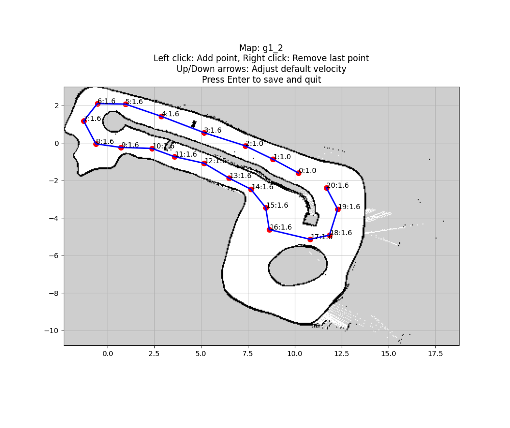

# Custom_Waypoints

This project allows you to create custom waypoints on a given 2D map, typically generated from a SLAM (Simultaneous Localization and Mapping) process, which can be used for path planning, navigation, or other robotics applications. The waypoints are defined by clicking on the map, and you can adjust the velocity of each waypoint and save the resulting trajectory.

### This tool is specifically designed to work with maps generated through 2D SLAM algorithms, and allows for the easy creation of custom trajectories for robot navigation.

## Features

- **Custom Waypoints**: Add waypoints on the map using left mouse clicks, and remove the last waypoint with a right-click.
- **Velocity Adjustment**: Use up and down arrow keys to adjust the velocity of the waypoints.
- **Trajectory Saving (Work in Progress)**: Save the trajectory to a CSV file that includes the waypoints' coordinates, velocity, direction (psi), and curvature (kappa). *This feature is still under development.*
- **Map Visualization (Work in Progress)**: View the map and the centerline (if available) while creating the waypoints. *This feature is still under development.*
- **SLAM Map Compatibility**: Works with 2D maps generated from SLAM algorithms, where the map is typically in `.pgm` format and is accompanied by a `.yaml` file containing map metadata (such as scale and origin).

### Current Functionalities

- **Waypoints Coordinates (x, y)**: Click to create waypoints and see the coordinates displayed.
- **Velocity**: Adjust the velocity of each waypoint and save it.
  
## Requirements

- Python 3.8
- `numpy`
- `matplotlib`
- `opencv-python`
- `pyyaml`

You can install the required dependencies using `pip`:

```bash
pip install numpy matplotlib opencv-python pyyaml
```
## launch image


## csv image


